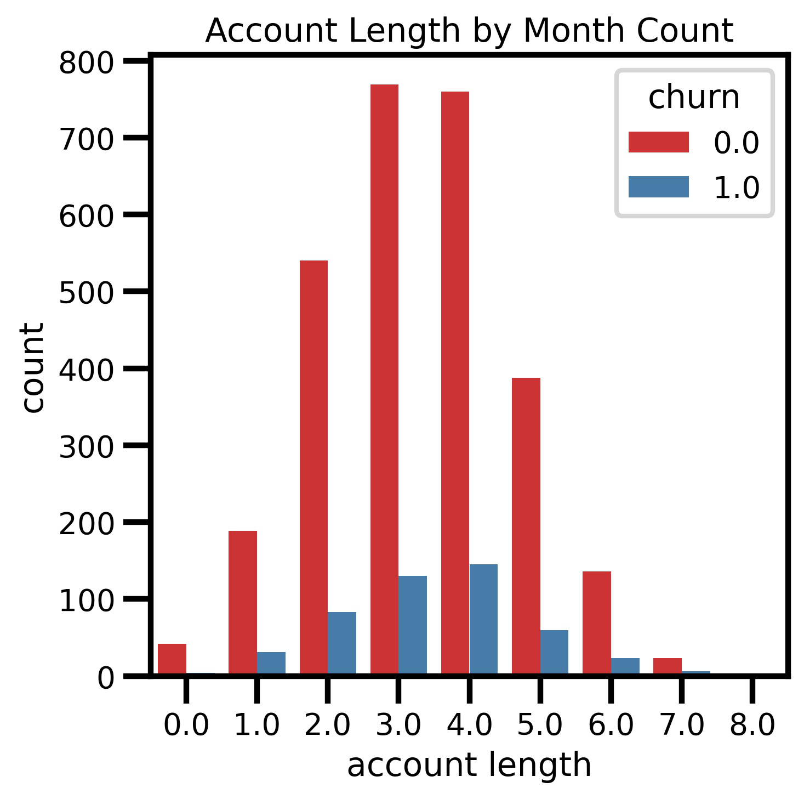

# SyriaTelProject
Flatiron Phase 3 Project - Customer Churn @ SyriaTel 
# Introduction
SyriaTel is a telecommunications company hoping to foresee and prevent client churn. Customer churn is the percentage of clients that quit utilizing an company's product or service during a specific time span. It very well may be a significant issue since it impacts a company's client faithfulness and ultimately influences company's revenue.
We built a classfier to predict when a customer will soon stop doing business with SyriaTel. The audience will be SyriaTel itself who are interested in how to improve their customer rettention rates.

# What modeling algorithm works best?
We used Logistic Regression, K-Neighbors, and Decision trees to model our prediction for churn data.

# Models

## Account Length
We saw that account length doesn't seem to have a significant effect on the overall chance a customer quits the service or not because the means and standard deviations are relatively the same 

### International Plan

### State

### Voicemail Plan

### Customer Service Calls

### Rates 

### Total Calls
# Interpretation

# Recommendation
- We recommend that we should implement customer feedback surveys for customer churn. We could provide an incentive for customers to fill out a survery if they end up leaving us. We could have questions like what they like about our service or what we could have done to better our services. By provding them a incentive to fill out a survery it would increase the probabilty of customers filling it out. 
- Our second recommendation would be to revise the company's customer service protocol. Based off the "Customer Service Calls" model after a customer makes more than 3 calls to customer service there was a signifcant jump in the probabilty of churning. To treat this we could have a system that keeps track of how many calls have been recieved from a certain customer and flag that account so we know that we should be more sensitive to this customer.    
- Our final recommendation is to start a reach-out campaign for customers who have a international plan. Working with the marketing department we could start targeting customers with possible deals or promotions that we are offering in order to get new customers or ex customers back with better rates than our competitors. 

# Future Analysis
- We want to acquire more data on cell signals across the US for patterns in states with higher churn. Bad cell signals could indicate a higher probability that customers in a certain state will churn in that state. 
- In the future we would want to be able to use data on specific issues customers called in to customer service with so if we see that it is a repetitive issue we can quickly resolve it. If there is a trend in a specific issue then it is likely that more customers will have that issue as well.  
